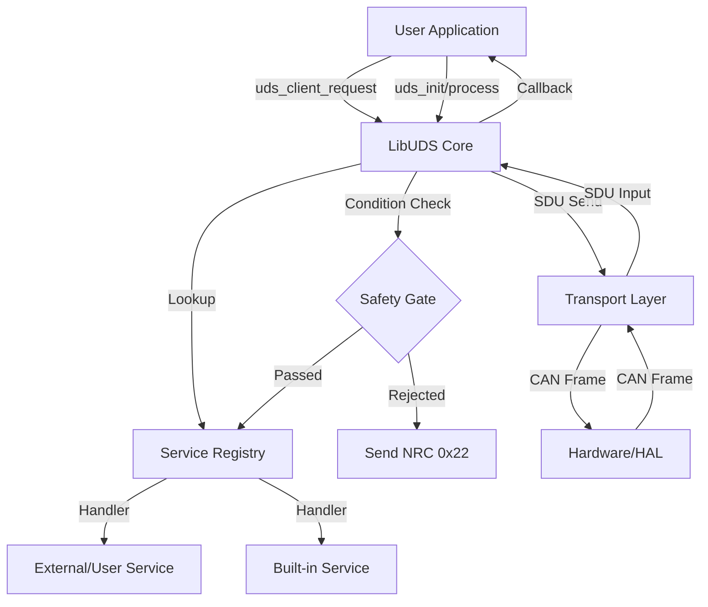

# LibUDS Architecture

This document describes the design philosophy and structural organization of the LibUDS stack.

## 1. Design Philosophy

LibUDS is built on three core pillars:
1.  **Strict Isolation**: The core logic is isolated from I/O and OS.
2.  **Zero Resource Ownership**: The library does not allocate memory or create threads.
3.  **Dependency Injection**: All platform-specific functionality is "injected" at runtime via function pointers.

## 2. Component Diagram
LibUDS is split into three main areas:

1.  **Service Registry**: A table-driven dispatcher that decouples core UDS logic from the protocol engine.
2.  **Core SDU Engine**: Handles protocol parsing and validation (Session, Security, Length).
3.  **State Manager**: Tracks active sessions, security levels, and protocol timers (S3, P2). Uses optional **NVM Persistence** hooks for recovery.
4.  **Transport Abstraction**: Spliced layer that either hooks into OS sockets (Zephyr/Linux) or uses the internal ISO-TP fallback.

## 3. Modular Service Architecture

LibUDS uses a **Table-Driven Dispatcher** to manage UDS services. This design provides:
- **Scalability**: Adding a new service (e.g., SID 0x29) only requires a new entry in the service table.
- **Extensibility**: Applications can register `user_services` in `uds_config_t` to override or extend built-in functionality.
- **Validation Priorities**: The core engine enforces ISO 14229-1 NRC priorities (Session → Length → Security → Safety) before calling the specific handler.

## 4. Safety Gates & Industrial Hardware

For industrial and automotive safety, LibUDS implements **Safety Gates**. 
Every potentially destructive service (Reset, Write, Download) is passed to an application-provided `fn_is_safe` callback. 

- If the callback returns `false`, the stack rejects the request with **NRC 0x22 (ConditionsNotCorrect)**.
- This allows engineers to block diagnostics while the vehicle is moving or the machine is in an unsafe state.

## 5. State Persistence (NVM)

The protocol state (Active Session and Security Level) can be persisted across power cycles using the **NVM Persistence Hooks**. 
- `fn_nvm_save`: Called when the session or security level changes.
- `fn_nvm_load`: Called during `uds_init` to restore the last known valid state.

## 6. The "Spliced Layer" Concept

One of the most complex parts of UDS is the Transport Layer (ISO 15765-2). 
LibUDS solves this by treating the Transport Layer as a "pluggable module".

### SDU vs PDU
- **SDU (Service Data Unit)**: A complete UDS message (e.g., `[0x10, 0x03]`).
- **PDU (Protocol Data Unit)**: An individual CAN frame (e.g., `[0x02, 0x10, 0x03, 0x00...]`).

The `libuds` core logic strictly consumes and produces **SDUs**. 

If the underlying OS (like Zephyr or Linux) provides a native ISO-TP stack, LibUDS talks to it directly at the SDU level. This avoids redundant reassembly logic and saves significant RAM/Flash.

If the OS is "dumb" (Bare Metal), LibUDS provides the `uds_tp_isotp.c` fallback which handles reassembly internally, converting the Core's SDUs into raw CAN PDUs.

## 4. Memory Management

To ensure MISRA-C compliance and high reliability, LibUDS:
- **Never calls `malloc()` or `free()`**.
- Uses caller-provided buffers for RX and TX operations.
- Uses fixed-size message structures.

## 5. Non-Blocking Design (Tickless)

The `uds_process()` function is the heart of the stack. It is designed to be called in a loop but never blocks. It uses the `get_time_ms()` callback to check if internal timers (S3, P2, P2*) have expired. 

This allows `libuds` to be integrated into any scheduling model:
- **Super Loop**: Call it once per loop.
- **RTOS Task**: Call it periodically with `vTaskDelay` or `k_sleep`.
- **Interrupt Mode**: Call it when a timer hardware triggers.
