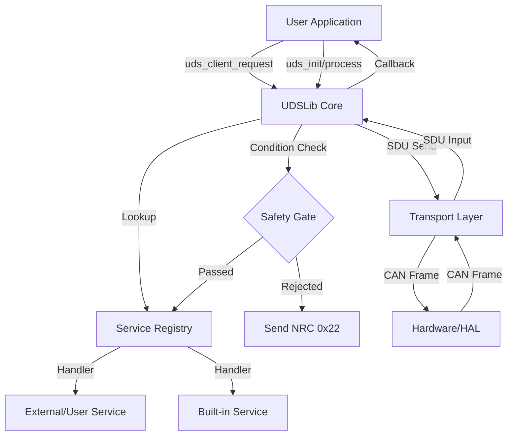

# UDSLib Architecture

UDSLib separates core diagnostic logic from the input/output layer and the operating system.

## 1. Design Principles

Three rules define the library's structure:

1.  **Strict Isolation**: Logic runs independently of I/O and OS specifics.
2.  **No Resource Ownership**: The library does not allocate memory or create threads.
3.  **Dependency Injection**: Platform-specific functions are injected at runtime via function pointers.

## 2. Component Structure

The library divides into four main areas:

1.  **Service Registry**: A table-driven dispatcher that routes requests.
2.  **Core SDU Engine**: Parses and validates protocol requirements (Session, Security, Length).
3.  **State Manager**: Tracks sessions, security levels, and timers (S3, P2, P2*). It uses optional hooks for NVM persistence. An opt-in built-in session policy (`restrict_sessions`) can confine privileged services to ISO-sensible sessions.
4.  **Transport Abstraction**: A layer that connects to OS sockets (Zephyr/Linux) or uses the internal ISO-TP fallback.

```mermaid
graph TD
    App[User Application] -->|uds_client_request| Core
    App -->|uds_init/process| Core
    Core -->|Lookup| Registry[Service Registry]
    Registry -->|Handler| Ext[External/User Service]
    Registry -->|Handler| Builtin[Built-in Service]
    Core -->|Condition Check| Gate{Safety Gate}
    Gate -->|Passed| Registry
    Gate -->|Rejected| NRC[Send NRC 0x22]
    Core[UDSLib Core] -->|SDU Send| TP[Transport Layer]
    TP -->|CAN Frame| HW[Hardware/HAL]
    HW -->|CAN Frame| TP
    TP -->|SDU Input| Core
    Core -->|Callback| App
```

## 3. Modular Service Registry

A table-driven dispatcher manages UDS services (22 of 27 ISO 14229-1 application
services are implemented; see [SERVICE_COMPLIANCE.md](SERVICE_COMPLIANCE.md) for
the authoritative matrix).

- **Scalability**: Adding a service (like SID 0x29) requires adding an entry to the `core_services` table.
- **Extensibility**: Applications register `user_services` in `uds_config_t` to override or extend standard functionality.
- **Validation**: The core engine enforces ISO 14229-1 NRC priorities (Session → Subfunction → Length → Security → Safety) before calling the handler.

## 4. Safety Gates

For industrial and automotive safety, UDSLib implements **Safety Gates**.

Every potentially destructive service (Reset, Write, Download) passes through an application-provided `fn_is_safe` callback.

- If the callback returns `false`, the stack rejects the request with **NRC 0x22 (ConditionsNotCorrect)**.
- This allows engineers to block diagnostics when the machine is in an unsafe state.

## 5. State Persistence (NVM)

The protocol state (Active Session and Security Level) persists across power cycles using **NVM Persistence Hooks**.

- `fn_nvm_save`: Runs when the session or security level changes.
- `fn_nvm_load`: Runs during `uds_init` to restore the last known valid state.

## 6. Spliced Transport Layer

The Transport Layer (ISO 15765-2) operates as a pluggable module.

### SDU vs PDU
- **SDU (Service Data Unit)**: A complete UDS message (e.g., `[0x10, 0x03]`).
- **PDU (Protocol Data Unit)**: A single CAN frame (e.g., `[0x02, 0x10, 0x03, 0x00...]`).

The `udslib` core logic strictly consumes and produces **SDUs**.

If the underlying OS (like Zephyr or Linux) has a native ISO-TP stack, UDSLib communicates directly at the SDU level. This removes redundant reassembly logic.

If the OS is "dumb" (Bare Metal), UDSLib uses the `uds_tp_isotp.c` fallback to handle reassembly, converting SDUs into raw CAN PDUs.

## 7. Memory Management

To ensure MISRA-C compliance and reliability:
- The library **never calls `malloc()` or `free()`**.
- The caller provides buffers for RX and TX operations.
- Message structures use fixed sizes.

## 8. Scheduling and Concurrency

The server has two entry points, and the scheduling model is defined entirely by
where each one runs:

- `uds_input_sdu()` / `uds_input_sdu_addr()` — the **receive path**. Called for
  each inbound SDU, from a transport task or an RX interrupt.
- `uds_process()` — the **periodic tick**. It is non-blocking: it uses
  `get_time_ms()` to check the S3/P2/P2\* timers, advances the responsePending
  state machine, runs the 0x2A periodic and 0x86 ResponseOnEvent schedulers, and
  drains any deferred post-TX action. It must be called regularly.

`uds_process()` fits any substrate:

- **Super loop**: call once per loop.
- **RTOS task**: call periodically (`vTaskDelay` / `k_sleep`).
- **Timer interrupt**: call when a hardware timer fires.

### Running the two contexts concurrently

The two entry points may run in different contexts at the same time (RX task vs.
process task, or RX interrupt vs. main loop) **only when the OSAL mutex callbacks
are supplied** (`docs/OSAL.md`). The mutex makes the two critical sections
mutually exclusive over the shared state (session, security, timers, the
post-TX action, the periodic/ROE schedule). The cross-context fields are
`volatile` so the compiler cannot cache a stale copy across the critical section
when the lock is a bare interrupt-disable.

Key rule: **`fn_tp_send` is invoked outside the lock.** Each entry point builds
its response under the lock, latches the length, releases the lock, then
transmits. A slow or blocking transport therefore never stalls the other context
(or, under an interrupt-disable lock, never extends interrupt latency). When RX
runs in an interrupt, the lock must be an ISR-safe critical section
(disable-IRQ / BASEPRI), not an RTOS mutex — see `docs/OSAL.md`. Two threads both
calling `uds_input_sdu()` on one context is *not* a supported configuration; UDS
is one-request-at-a-time.

## 9. State-Commit Model

Service state — the active session, the security level, and the transfer
(download/upload) state — **commits when the handler returns and is not rolled
back if the subsequent emit fails.** A handler that, say, unlocks security or
enters the programming session has already mutated the context by the time the
framework tries to put the positive response on the wire; if `fn_tp_send` then
rejects the frame, the state change stands.

This is deliberate. On CAN, `fn_tp_send` is *queue-not-wire*: a successful return
means the frame was accepted into a transmit mailbox, not that the tester
received it. There is no point at which the library could know a response was
truly delivered, so unwinding committed state on a queue rejection would trade a
well-defined state for a guess — and the tester resynchronises on its next
request regardless.

The **only** emit-gated operations are the deferred post-TX actions: **ECUReset
(0x11)** and the **LinkControl (0x87) transition**. These are disruptive (a
reboot or a bus-parameter switch) and must not happen if the tester never got its
confirmation, so the post-TX engine runs them only after the response has been
handed to the transport (`emit_ok`) and, when `fn_tx_complete` is supplied, only
after the frame has physically drained. A failed emit cancels them. Ordinary
session/security/transfer state has no such gate.
