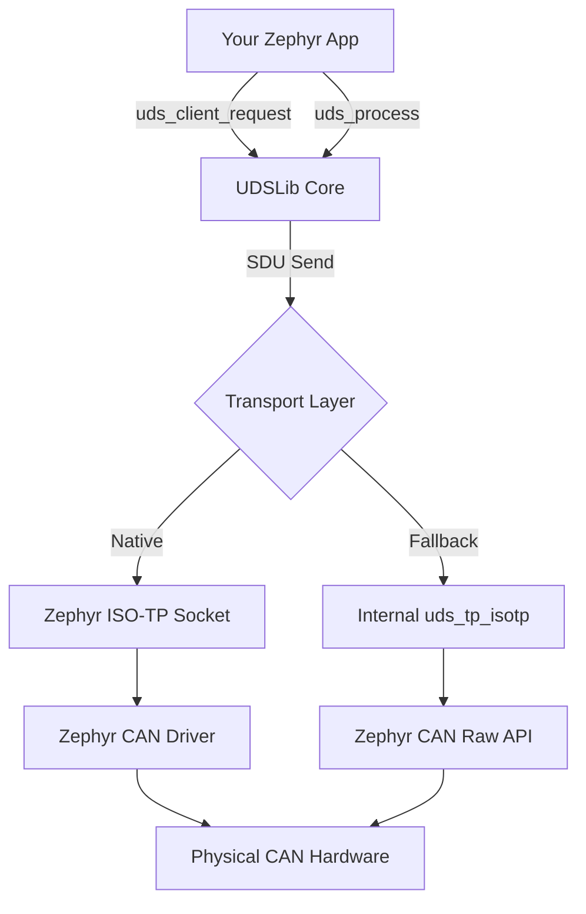

# Zephyr OS Integration Guide

UDSLib is designed from the ground up to integrate seamlessly with Zephyr OS, leveraging Zephyr's native CAN and ISO-TP subsystems while maintaining the portability to fall back to the internal ISO-TP implementation when needed.

## Architecture Overview


```mermaid
graph TD
    A[Your Zephyr App] -->|uds_client_request| B[UDSLib Core]
    A -->|uds_process| B
    B -->|SDU Send| C{Transport Layer}
    C -->|Native| D[Zephyr ISO-TP Socket]
    C -->|Fallback| E[Internal uds_tp_isotp]
    D --> F[Zephyr CAN Driver]
    E --> G[Zephyr CAN Raw API]
    F --> H[Physical CAN Hardware]
    G --> H
```

## Integration Models

### Model 1: Native Zephyr ISO-TP (Recommended)

**When to use**: Your Zephyr build includes `CONFIG_CAN_ISOTP=y`

**Advantages**:
- Zero-copy transport implementation
- Maintained by Zephyr project
- Minimal memory footprint
- Hardware-accelerated CAN filtering

**Memory Footprint**: ~2-3 KB (core only, no transport duplication)

#### Implementation

```c
#include <zephyr/kernel.h>
#include <zephyr/net/socketcan.h>
#include <zephyr/net/socketcan_utils.h>
#include <uds/uds_core.h>

/* 1. Create ISO-TP socket */
int isotp_sock = socket(AF_CAN, SOCK_DGRAM, CAN_ISOTP);

struct sockaddr_can addr = {
    .can_family = AF_CAN,
    .can_ifindex = if_nametoindex("can0"),
    .can_addr.isotp.tx_id = 0x7E0,
    .can_addr.isotp.rx_id = 0x7E8,
};

bind(isotp_sock, (struct sockaddr *)&addr, sizeof(addr));

/* 2. Zephyr-specific TP send function */
int zephyr_tp_send(uds_ctx_t* ctx, const uint8_t* data, uint16_t len) {
    return send(isotp_sock, data, len, 0);
}

/* 3. Zephyr time source */
uint32_t zephyr_get_time_ms(void) {
    return k_uptime_get_32();
}

/* 4. Initialize UDSLib */
uds_config_t cfg = {
    .fn_tp_send = zephyr_tp_send,
    .get_time_ms = zephyr_get_time_ms,
    .rx_buffer = rx_buf,
    .rx_buffer_size = sizeof(rx_buf),
    .tx_buffer = tx_buf,
    .tx_buffer_size = sizeof(tx_buf),
};

uds_init(&ctx, &cfg);

/* 5. Receive thread */
void isotp_rx_thread(void) {
    uint8_t sdu[4095];
    while (1) {
        int len = recv(isotp_sock, sdu, sizeof(sdu), 0);
        if (len > 0) {
            uds_input_sdu(&ctx, sdu, len);
        }
    }
}
```

### Model 2: Fallback for Minimal Zephyr

**When to use**: Constrained builds or custom CAN drivers

**Advantages**:
- No dependency on Zephyr ISO-TP subsystem
- Fine-grained control over CAN filtering
- Deterministic memory usage

**Memory Footprint**: ~3-4 KB (includes internal ISO-TP)

#### Implementation

The fallback transport (`zephyr/uds_zephyr_tp_fallback.c`) owns its ISO-TP
instance privately and binds to the CAN controller chosen via
`DT_CHOSEN(zephyr_canbus)`. It exposes three adapter functions: an init that
sets up the instance plus the CAN RX filter, a `fn_tp_send` adapter, and a
periodic process hook. The application just wires them up:

```c
#include <uds/uds_core.h>
#include <uds/uds_isotp.h>

/* Provided by zephyr/uds_zephyr_tp_fallback.c (CONFIG_UDSLIB_TRANSPORT_FALLBACK). */
extern int  uds_zephyr_tp_fallback_init(struct uds_ctx* uds_ctx, uint32_t rx_id, uint32_t tx_id);
extern int  uds_zephyr_tp_fallback_send(struct uds_ctx* uds_ctx, const uint8_t* data, uint16_t len);
extern void uds_zephyr_tp_fallback_process(uint32_t time_ms);

/* 1. Initialize the fallback transport (creates the ISO-TP instance and
 *    installs the CAN RX filter on the chosen zephyr,canbus device). */
if (uds_zephyr_tp_fallback_init(&ctx, 0x7E0 /* rx_id */, 0x7E8 /* tx_id */) < 0) {
    printk("Failed to init Fallback ISO-TP shim\n");
    return -1;
}

/* 2. Wire the send adapter as fn_tp_send in the UDS config. */
uds_config_t config = {
    .rx_buffer = rx_buf,
    .rx_buffer_size = sizeof(rx_buf),
    .tx_buffer = tx_buf,
    .tx_buffer_size = sizeof(tx_buf),
    .get_time_ms = zephyr_get_time_ms,
    .fn_tp_send = uds_zephyr_tp_fallback_send,
};
uds_init(&ctx, &config);

/* 3. Main loop: drive timers/CF transmission and the core state machine.
 *    (Reception is handled inside the fallback's CAN RX callback.) */
while (1) {
    uds_zephyr_tp_fallback_process(k_uptime_get_32()); // multi-frame CF transmission
    uds_process(&ctx);
    k_sleep(K_MSEC(1));
}
```

## Build System Integration

### As a Zephyr Module

**Directory Structure**:
```
udslib/
├── zephyr/
│   ├── module.yml          # Zephyr module definition
│   ├── CMakeLists.txt      # Build integration
│   └── Kconfig             # Configuration options
├── src/
│   └── core/
│       └── uds_core.c
└── include/
    └── uds/
        └── uds_core.h
```

### `zephyr/module.yml`

```yaml
name: udslib
build:
  cmake: .
  kconfig: Kconfig
```

### `zephyr/Kconfig`

```kconfig
config UDSLIB
    bool "UDSLib - Unified Diagnostic Services"
    help
      Portable UDS (ISO 14229) protocol stack

if UDSLIB

choice UDSLIB_TRANSPORT
    prompt "Transport Layer"
    default UDSLIB_TRANSPORT_NATIVE if CAN_ISOTP
    default UDSLIB_TRANSPORT_FALLBACK

config UDSLIB_TRANSPORT_NATIVE
    bool "Use Zephyr ISO-TP sockets"
    depends on CAN_ISOTP
    help
      Leverage Zephyr's native ISO-TP implementation.

config UDSLIB_TRANSPORT_FALLBACK
    bool "Use internal ISO-TP fallback"
    help
      Use UDSLib internal ISO-TP for bare-metal or custom setups.

endchoice

config UDSLIB_MAX_SDU_SIZE
    int "Maximum UDS SDU size"
    default 4095
    range 256 4095

config UDSLIB_LOG_LEVEL
    int "Log level"
    default 3
    range 0 4

endif # UDSLIB
```

### `zephyr/CMakeLists.txt`

```cmake
zephyr_library()

zephyr_library_sources(
    ../src/core/uds_core.c
)

if(CONFIG_UDSLIB_TRANSPORT_NATIVE)
    zephyr_library_sources(
        uds_zephyr_isotp.c
    )
endif()

if(CONFIG_UDSLIB_TRANSPORT_FALLBACK)
    # Internal ISO-TP engine plus the Zephyr fallback adapter that owns the
    # ISO-TP instance and exposes the init/send/process functions.
    zephyr_library_sources(
        ../src/transport/uds_tp_isotp.c
        uds_zephyr_tp_fallback.c
    )
endif()

zephyr_include_directories(../include)
```

### Application `prj.conf`

```ini
# CAN Configuration
CONFIG_CAN=y
CONFIG_CAN_SHELL=y

# ISO-TP (for native mode)
CONFIG_CAN_ISOTP=y
CONFIG_NET=y
CONFIG_NET_SOCKETS=y
CONFIG_NET_SOCKETCAN=y

# UDSLib
CONFIG_UDSLIB=y
CONFIG_UDSLIB_TRANSPORT_NATIVE=y
```

## Simulated Target Testing

### Using `native_sim` (Linux Host)

The `native_sim` board allows running Zephyr applications as Linux processes with virtual CAN interfaces.

#### Setup

```bash
# 1. Install dependencies
sudo apt install can-utils linux-modules-extra-$(uname -r)

# 2. Load kernel modules
sudo modprobe can
sudo modprobe can_raw
sudo modprobe vcan

# 3. Create virtual CAN interface
sudo ip link add dev vcan0 type vcan
sudo ip link set vcan0 up
```

#### Build & Run

```bash
cd udslib/examples/zephyr_uds_server

# Build for native_sim
west build -b native_sim

# Run (will attach to vcan0)
./build/zephyr/zephyr.exe
```

#### Testing Against External Tools

```bash
# Terminal 1: Zephyr UDS Server
./build/zephyr/zephyr.exe

# Terminal 2: Test with isotpsend/isotprecv
echo "10 03" | isotpsend -s 7E0 -d 7E8 vcan0
isotprecv -s 7E8 -d 7E0 vcan0  # Should see: 50 03 ...

# Terminal 3: Or test with UDSLib client_demo
cd ../../
./examples/client_demo/uds_client_demo vcan0
```

### Using QEMU (x86 Emulation)

For more realistic hardware emulation:

```bash
west build -b qemu_x86

# QEMU will create a virtual CAN device accessible via network bridge
west build -t run
```

## Thread Safety & RTOS Considerations

### Non-Blocking Design

The simplest integration drives both entry points from one cooperative task:

```c
void uds_task(void *p1, void *p2, void *p3) {
    while (1) {
        uds_process(&ctx);                           // Check timers, handle state machine
        uds_zephyr_tp_fallback_process(k_uptime_get_32()); // (If using fallback) Send pending CFs
        k_sleep(K_MSEC(1));                          // Yield to other tasks
    }
}

K_THREAD_DEFINE(uds_thread, 2048, uds_task, NULL, NULL, NULL, 5, 0, 0);
```

### Two-context concurrency

`uds_input_sdu()` (the RX path) and `uds_process()` (the periodic tick) may run
in two different contexts at once — an RX task vs. a process task, or an RX
interrupt vs. the main loop — **provided the OSAL mutex callbacks are supplied**.
Supply `fn_mutex_lock`/`fn_mutex_unlock` (e.g. `k_mutex` for task-vs-task, or an
ISR-safe disable-IRQ critical section when RX runs in an interrupt). `fn_tp_send`
runs outside the lock, so a slow transport never stalls the other context. See
[docs/OSAL.md](OSAL.md) for the authoritative concurrency model. Two threads
calling `uds_input_sdu()` on one context concurrently is not supported (UDS is
one-request-at-a-time).

### ISR delivery

- The fallback transport installs its own CAN RX filter callback and feeds
  frames into its private ISO-TP instance, so RX is handled for you.
- If you drive the raw instance-based ISO-TP API yourself, you may either defer
  ISR work to thread context via a message queue/workqueue (shown below), or
  call `uds_input_sdu()` directly from the ISR — in which case the OSAL lock
  must be an ISR-safe disable-IRQ critical section, not a `k_mutex`. The receive
  callback is instance-based and takes both the ISO-TP and core contexts:

```c
/* You own and initialize the ISO-TP instance:
 *   uds_isotp_ctx_t iso;
 *   uint8_t iso_tx_sdu[CONFIG_UDSLIB_TX_BUFFER_SIZE];
 *   uds_tp_isotp_init(&iso, can_send, 0x7E8, 0x7E0, iso_tx_sdu, sizeof(iso_tx_sdu));
 */
K_MSGQ_DEFINE(can_rx_msgq, sizeof(struct can_frame), 10, 4);

void can_isr(const struct device *dev, struct can_frame *frame, void *user_data) {
    k_msgq_put(&can_rx_msgq, frame, K_NO_WAIT);
}

void uds_task(void) {
    struct can_frame frame;
    while (1) {
        if (k_msgq_get(&can_rx_msgq, &frame, K_MSEC(10)) == 0) {
            uds_isotp_rx_callback(&iso, &ctx, frame.id, frame.data, frame.dlc);
        }
        uds_process(&ctx);
        uds_tp_isotp_process(&iso, k_uptime_get_32());
    }
}
```

## Memory Footprint Analysis

| Component | Native Mode | Fallback Mode |
|:----------|:------------|:--------------|
| Core Stack | 1.2 KB | 1.2 KB |
| ISO-TP Layer | 0 KB (Zephyr) | 2.0 KB |
| RX Buffer | 4.0 KB | 4.0 KB |
| TX Buffer | 4.0 KB | 4.0 KB |
| **Total** | **~9 KB** | **~11 KB** |

*Based on typical configuration with 4KB buffers and -Os optimization*

## Configuration Best Practices

### For Production ECUs
```ini
CONFIG_UDSLIB_TRANSPORT_NATIVE=y    # Use Zephyr's ISO-TP
CONFIG_UDSLIB_MAX_SDU_SIZE=256      # Constrain memory
CONFIG_LOG=n                        # Disable logging
```

### For Development/Testing
```ini
CONFIG_UDSLIB_TRANSPORT_FALLBACK=y  # More control
CONFIG_UDSLIB_LOG_LEVEL=4           # Verbose logging
CONFIG_SHELL=y                      # Enable shell commands
```

## Next Steps

- Review [TESTING_STRATEGY.md](TESTING_STRATEGY.md) for validation approaches
- See [QUICKSTART_ZEPHYR.md](QUICKSTART_ZEPHYR.md) for a 5-minute example
- Explore `examples/zephyr_uds_server/` for complete working code
